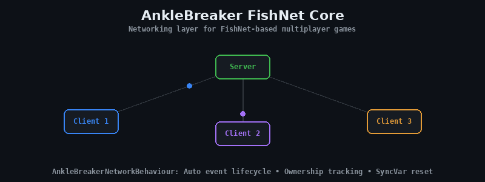

<p align="center">
  
</p>

# AnkleBreaker FishNet Core — Unity Multiplayer Networking Layer

> **Core FishNet networking abstractions and utilities for multiplayer Unity games.** AnkleBreakerNetworkBehaviour with automatic event lifecycle, ownership tracking, SyncVar reset, and a searchable prefab selector. Built on [Fish-Networking](https://fish-networking.gitbook.io/docs). UPM-ready. Free and open source by [AnkleBreaker Studio](https://github.com/AnkleBreaker-Studio).

[](https://github.com/sponsors/AnkleBreaker-Studio)

## Features

- **AnkleBreakerNetworkBehaviour**: Abstract base class extending `NetworkBehaviour` with automatic event handler registration/unregistration on network start/stop, SyncVar-based behaviour reset mechanism, ownership change tracking with server and client callbacks for player connect/disconnect, `IsLocallyReady` state tracking, and `S_OnClientOwnerIsReady` server callback when the owning client is ready.

- **AKSinglePrefabs**: Custom `SinglePrefabObjects` wrapper with null entry cleanup and custom editor.

- **NetPrefabsSelectorWindow**: Searchable EditorWindow for selecting network prefabs with multi-select support.

- **Extension Methods**: `NetworkConnection.GetPlayerObjectId()` / `GetPlayerObject()` for quick access to a connection's player object, `int.TryGetNetworkObjectFromObjectId()` to resolve ObjectId to NetworkObject (client or server), `int.L_IsLocalPlayerNobId()` to check if an ObjectId belongs to the local player, and `SinglePrefabObjects.LookupSpawnablePrefab(name)` to find a prefab by name in a prefab collection.

## Installation

Add via Unity Package Manager using the Git URL:

```
https://github.com/AnkleBreaker-Studio/AnkleBreaker-FishNet-Core.git
```

## Quick Start

1. Install the package via the Package Manager
2. Ensure FishNet is installed in your project
3. Create your networked scripts by extending `AnkleBreakerNetworkBehaviour`
4. Override `EventHandlerRegister()` and `EventHandlerUnRegister()` for event lifecycle
5. Use `S_OnClientOwnerIsReady()` to react when the owning client is ready
6. Use `S_OnPlayerConnect()` / `S_OnPlayerDisconnect()` for ownership change callbacks

## Dependencies

- [FishNet (Fish-Networking)](https://fish-networking.gitbook.io/docs)

## Package Structure

```
AnkleBreaker-FishNet-Core/
├── Core/
│   └── 1-Scripts/
│       └── Runtime/
│           ├── Anklebreaker.Core.Fishnet.asmdef
│           └── AnkleBreakerNetworkBehaviour.cs
├── Utils/
│   └── 1-Scripts/
│       ├── Editor/
│       │   ├── AKSinglePrefabsEditor.cs
│       │   ├── AnkleBreaker.Utils.Fishnet.Editor.asmdef
│       │   └── NetPrefabsSelectorWindow.cs
│       └── Runtime/
│           └── FishNet/
│               ├── AKSinglePrefabs.cs
│               ├── AnkleBreaker.Utils.Fishnet.asmdef
│               └── ExtensionMethods/
├── package.json
├── README.md
└── CHANGELOG.md
```

## Part of the AnkleBreaker Ecosystem

| Package | Description |
|---------|-------------|
| [AnkleBreaker-Core](https://github.com/AnkleBreaker-Studio/AnkleBreaker-Core) | Base classes, interfaces, delegates |
| [Utils-Inspector](https://github.com/AnkleBreaker-Studio/AnkleBreaker-Utils-Inspector) | 40+ custom inspector attributes (free Odin alternative) |
| **FishNet-Core** (this) | FishNet networking layer |
| [Unity MCP](https://github.com/AnkleBreaker-Studio/unity-mcp-server) | 268 AI tools for Unity Editor control |

## Requirements

- Unity 2022.3 LTS or later
- FishNet (Fish-Networking)

## License

See [LICENSE.md](LICENSE.md)
